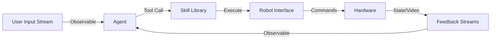

# Agent-to-Robot Integration Guide

This guide explains the complete pipeline from natural language input to robot actions in DIMOS, covering every integration point in the framework.

## Table of Contents

1. [Architecture Overview](#architecture-overview)
2. [Complete Integration Pipeline](#complete-integration-pipeline)
3. [Key Components](#key-components)
4. [Code Examples](#code-examples)
5. [Error Handling](#error-handling)
6. [Best Practices](#best-practices)

## Architecture Overview

### The Complete Pipeline

```
User Input → Agent → Tool Calls → Skills → Robot Interface → Hardware
    ↑                                                              ↓
    └─────────────── Feedback Loop (State, Telemetry) ───────────┘
```

### Data Flow



DIMOS uses **reactive programming (RxPY)** for all data flow, enabling:
- Asynchronous processing
- Stream transformations
- Backpressure handling
- Real-time feedback loops

## Complete Integration Pipeline

### 1. Input Streams: Connecting Query Sources

Agents receive input via **Observable streams** that can come from various sources:

#### Web UI Input
```python
from dimos.web.robot_web_interface import RobotWebInterface

# Create web interface
web_interface = RobotWebInterface(port=5555)

# The query_stream is an Observable<str>
query_stream = web_interface.query_stream
```

#### Direct Observable Creation
```python
import reactivex as rx
from reactivex.subject import Subject

# Create a Subject for manual query injection
query_subject = Subject()

# Convert to observable
query_stream = query_subject.pipe()

# Later, send queries
query_subject.on_next("Move forward 2 meters")
```

#### CLI Input
```python
def create_cli_query_stream():
    """Create observable from CLI input."""
    def subscribe(observer, scheduler=None):
        def input_loop():
            while True:
                try:
                    query = input("Enter command: ")
                    if query.lower() == 'exit':
                        observer.on_completed()
                        break
                    observer.on_next(query)
                except Exception as e:
                    observer.on_error(e)
        
        import threading
        thread = threading.Thread(target=input_loop, daemon=True)
        thread.start()
    
    return rx.create(subscribe)

query_stream = create_cli_query_stream()
```

### 2. Agent Configuration

Agents are the decision-making layer that process inputs and decide which skills to invoke.

#### Basic Agent Setup
```python
from dimos.agents.agent import OpenAIAgent
from dimos.robot.unitree.unitree_go2 import UnitreeGo2

# Initialize robot
robot = UnitreeGo2(ip="192.168.123.161")

# Create agent
agent = OpenAIAgent(
    dev_name="ExecutorAgent",
    input_query_stream=query_stream,          # Input source
    skills=robot.get_skills(),                # Available skills
    system_query="You are a helpful robot assistant.",
    model_name="gpt-4o",                      # Vision-capable model
    input_video_stream=robot.get_ros_video_stream()  # Optional: video feed
)
```

#### Agent Configuration Options

| Parameter | Type | Description |
|-----------|------|-------------|
| `dev_name` | str | Agent identifier for logging |
| `input_query_stream` | Observable[str] | Text query input stream |
| `input_video_stream` | Observable[np.ndarray] | Optional video feed |
| `skills` | SkillLibrary or List[AbstractSkill] | Available skills/tools |
| `system_query` | str | System prompt defining agent behavior |
| `model_name` | str | LLM model (e.g., "gpt-4o", "gpt-4o-mini") |
| `agent_memory` | AbstractAgentSemanticMemory | Optional semantic memory |
| `max_input_tokens_per_request` | int | Token budget for inputs |
| `rag_query_n` | int | Number of memory results to retrieve |

### 3. Tool Calling: How LLM Decides Which Skills to Invoke

When an agent receives a query, it follows this process:

```
1. Query arrives via input_query_stream
2. Agent builds context (system prompt + memory + query)
3. Agent sends context to LLM with available tools
4. LLM returns tool calls (if needed) or text response
5. Agent executes tool calls → invokes skills
6. Results returned to LLM for final response
```

#### Under the Hood

```python
# From dimos/agents/agent.py (simplified)
class OpenAIAgent(LLMAgent):
    def _process_query(self, query: str):
        """Process a query through the agent."""
        
        # 1. Build messages with context
        messages = self.prompt_builder.build_messages(
            query=query,
            system_prompt=self.system_query,
            memory_context=self._get_memory_context(query)
        )
        
        # 2. Get tool schemas from skills
        tools = self._get_tool_schemas()
        
        # 3. Call LLM
        response = self.client.chat.completions.create(
            model=self.model_name,
            messages=messages,
            tools=tools if tools else NOT_GIVEN
        )
        
        # 4. Process tool calls
        if response.choices[0].message.tool_calls:
            for tool_call in response.choices[0].message.tool_calls:
                result = self._execute_tool(tool_call)
                # Add result to context for final response
        
        return response.choices[0].message.content
```

#### Tool Schema Generation

Skills are automatically converted to OpenAI tool schemas:

```python
from dimos.skills.skills import AbstractRobotSkill
from pydantic import Field

class Move(AbstractRobotSkill):
    """Move the robot forward."""
    distance: float = Field(..., description="Distance in meters")
    speed: float = Field(default=0.5, description="Speed in m/s")
```

Becomes:

```json
{
  "type": "function",
  "function": {
    "name": "Move",
    "description": "Move the robot forward.",
    "parameters": {
      "type": "object",
      "properties": {
        "distance": {
          "type": "number",
          "description": "Distance in meters"
        },
        "speed": {
          "type": "number",
          "description": "Speed in m/s"
        }
      },
      "required": ["distance"]
    }
  }
}
```

### 4. Skill Execution

When the LLM decides to invoke a skill, the agent:

1. **Validates parameters** using Pydantic
2. **Instantiates the skill** with provided parameters
3. **Calls skill.validate()** for pre-execution checks
4. **Executes skill.__call__()** to perform the action
5. **Returns result** to LLM

#### Example Execution Flow

```python
# User query: "Move forward 2 meters"
# LLM decides to use Move skill

# 1. Agent receives tool call
tool_call = {
    "name": "Move",
    "arguments": {"distance": 2.0, "speed": 0.5}
}

# 2. Instantiate skill
skill = Move(robot=robot, **tool_call["arguments"])

# 3. Validate
is_valid, error_msg = skill.validate()
if not is_valid:
    return f"Error: {error_msg}"

# 4. Execute
result = skill()  # Calls skill.__call__()

# 5. Return result
# "Successfully moved 2.0 meters"
```

### 5. Robot Interface: Skills to Robot Commands

Skills translate high-level intentions into robot-specific commands.

#### ROS2 Command Example

```python
class Move(AbstractRobotSkill):
    distance: float = Field(..., description="Distance in meters")
    speed: float = Field(default=0.5, description="Speed in m/s")
    
    def __call__(self):
        super().__call__()  # Validates robot instance
        
        # Access robot's ROS control
        if hasattr(self._robot, 'ros_control'):
            # Calculate duration
            duration = self.distance / self.speed
            
            # Send velocity command
            self._robot.ros_control.send_velocity(
                linear_x=self.speed,
                duration=duration
            )
            
            return f"Moving {self.distance}m at {self.speed}m/s"
        else:
            return "Error: No ROS control available"
```

#### WebRTC API Command Example

```python
class FrontFlip(AbstractRobotSkill):
    """Perform a front flip (Unitree specific)."""
    
    def __call__(self):
        super().__call__()
        
        # Unitree WebRTC API ID for front flip
        api_id = 1001
        
        # Send WebRTC command
        self._robot.webrtc_req(api_id=api_id)
        
        return "Executing front flip"
```

### 6. Feedback Loop: State Updates and Observables

The robot continuously publishes state information back to the system:

```python
# Robot publishes observables
robot.get_ros_video_stream()        # Observable<np.ndarray>
robot.get_state_observable()        # Observable<RobotState>
robot.get_position_observable()     # Observable<Pose>
```

Agents can subscribe to these streams:

```python
# Agent with vision feedback
agent = OpenAIAgent(
    dev_name="VisionAgent",
    input_query_stream=query_stream,
    input_video_stream=robot.get_ros_video_stream(),  # Video feedback
    skills=robot.get_skills(),
    system_query="Describe what you see and navigate accordingly",
    model_name="gpt-4o"  # Vision-capable model
)
```

## Code Examples

### Example 1: End-to-End Natural Language → Robot Motion

```python
from dimos.robot.unitree.unitree_go2 import UnitreeGo2
from dimos.robot.unitree.unitree_skills import MyUnitreeSkills
from dimos.robot.unitree.unitree_ros_control import UnitreeROSControl
from dimos.agents.agent import OpenAIAgent
import reactivex as rx
from reactivex.subject import Subject
import time

# 1. Initialize robot
robot = UnitreeGo2(
    ip="192.168.123.161",
    ros_control=UnitreeROSControl(),
    skills=MyUnitreeSkills()
)

# 2. Create query stream
query_subject = Subject()

# 3. Initialize agent
agent = OpenAIAgent(
    dev_name="SimpleExecutor",
    input_query_stream=query_subject.pipe(),
    skills=robot.get_skills(),
    system_query="Execute movement commands. Be concise.",
    model_name="gpt-4o-mini"
)

# 4. Send commands
query_subject.on_next("Move forward 1 meter")
time.sleep(5)

query_subject.on_next("Turn left 90 degrees")
time.sleep(3)

query_subject.on_next("Do a front flip")
time.sleep(5)

# Keep alive
while True:
    time.sleep(1)
```

### Example 2: Multi-Step Mission with PlanningAgent

```python
from dimos.agents.planning_agent import PlanningAgent
from dimos.web.robot_web_interface import RobotWebInterface

# 1. Setup web interface
web_interface = RobotWebInterface(port=5555)

# 2. Initialize robot
robot = UnitreeGo2(
    ip="192.168.123.161",
    ros_control=UnitreeROSControl(),
    skills=MyUnitreeSkills()
)

# 3. Create planning agent (breaks down complex tasks)
planner = PlanningAgent(
    dev_name="MissionPlanner",
    input_query_stream=web_interface.query_stream,
    skills=robot.get_skills(),
    model_name="gpt-4o",
    system_query="""You are a mission planner. Break down complex 
    tasks into step-by-step plans using available skills."""
)

# 4. Create execution agent (executes individual steps)
executor = OpenAIAgent(
    dev_name="StepExecutor",
    input_query_stream=planner.get_response_observable(),  # Chained!
    skills=robot.get_skills(),
    model_name="gpt-4o-mini",
    system_query="Execute the given step. Output only skill calls."
)

# Now user can send: "Patrol the room and greet anyone you see"
# Planner breaks it down:
#   1. Move forward 3m
#   2. SpinLeft 90 degrees
#   3. Move forward 3m
#   4. SpinLeft 90 degrees
#   etc.
# Executor executes each step sequentially

while True:
    time.sleep(1)
```

### Example 3: Vision-Based Navigation

```python
# Agent with vision
agent = OpenAIAgent(
    dev_name="VisionNavigator",
    input_query_stream=query_subject.pipe(),
    input_video_stream=robot.get_ros_video_stream(),
    skills=robot.get_skills(),
    system_query="""You are a vision-based navigator. 
    Analyze the camera feed and navigate safely.
    Avoid obstacles and describe what you see.""",
    model_name="gpt-4o"  # Must use vision model
)

# Command with vision context
query_subject.on_next("Navigate forward while avoiding obstacles")

# Agent will:
# 1. See video frame
# 2. Analyze for obstacles
# 3. Decide safe movement
# 4. Execute Move skill with appropriate distance
# 5. Repeat with next frame
```

### Example 4: Error Handling and Recovery

```python
from dimos.skills.skills import AbstractRobotSkill
from pydantic import Field, validator

class SafeMove(AbstractRobotSkill):
    """Move with safety checks."""
    distance: float = Field(..., description="Distance in meters")
    max_distance: float = Field(default=5.0, description="Max safe distance")
    
    def validate(self) -> tuple[bool, str]:
        """Pre-execution validation."""
        if self.distance <= 0:
            return False, "Distance must be positive"
        
        if self.distance > self.max_distance:
            return False, f"Distance {self.distance}m exceeds max {self.max_distance}m"
        
        # Check robot state
        if hasattr(self._robot, 'get_battery_level'):
            battery = self._robot.get_battery_level()
            if battery < 20:
                return False, f"Battery too low: {battery}%"
        
        return True, ""
    
    def __call__(self):
        super().__call__()
        
        # Execute with try-catch
        try:
            result = self._robot.move(
                distance=self.distance,
                speed=0.5
            )
            return f"Successfully moved {self.distance}m"
        
        except Exception as e:
            error_msg = f"Movement failed: {str(e)}"
            print(error_msg)
            
            # Attempt recovery
            self._robot.stop()
            return error_msg
```

### Example 5: Custom Robot Platform Integration

```python
from dimos.robot.robot import Robot
from dimos.skills.skills import SkillLibrary
import reactivex as rx

class MyCustomRobot(Robot):
    """Integration for custom robot platform."""
    
    def __init__(self, api_endpoint: str, **kwargs):
        # Initialize your robot's API/SDK
        self.api = MyRobotAPI(api_endpoint)
        
        # Initialize base Robot
        super().__init__(**kwargs)
    
    def move(self, distance: float, speed: float = 0.5):
        """Implement movement for your robot."""
        duration = distance / speed
        
        # Call your robot's API
        response = self.api.send_velocity(
            velocity=speed,
            duration=duration
        )
        
        return response.success
    
    def get_ros_video_stream(self) -> rx.Observable:
        """Return video stream as observable."""
        def subscribe(observer, scheduler=None):
            # Convert your robot's video feed to observable
            def on_frame(frame):
                observer.on_next(frame)
            
            self.api.subscribe_video(callback=on_frame)
        
        return rx.create(subscribe)

# Use with DIMOS
custom_robot = MyCustomRobot(api_endpoint="http://192.168.1.100")
agent = OpenAIAgent(
    dev_name="CustomRobotAgent",
    input_query_stream=query_stream,
    skills=custom_robot.get_skills(),
    model_name="gpt-4o"
)
```

## Error Handling

### Common Issues and Solutions

#### 1. Agent Not Responding to Queries

**Symptoms**: Agent receives queries but doesn't invoke skills

**Causes**:
- Skills not properly registered
- Pydantic validation failures
- Missing required fields in tool call

**Solutions**:
```python
# Enable debug logging
import logging
logging.basicConfig(level=logging.DEBUG)

# Check skill registration
print(agent.skill_library.get_all_skills())

# Verify skill schemas
for skill in agent.skill_library.get_all_skills():
    print(skill.model_json_schema())
```

#### 2. Skills Failing to Execute

**Symptoms**: Tool calls succeed but skill execution fails

**Causes**:
- Robot not properly initialized
- Missing robot interface (ROS2 not running)
- Validation failures

**Solutions**:
```python
# Add comprehensive validation
class MySkill(AbstractRobotSkill):
    def validate(self) -> tuple[bool, str]:
        if self._robot is None:
            return False, "Robot not initialized"
        
        if not hasattr(self._robot, 'ros_control'):
            return False, "ROS control not available"
        
        if self._robot.ros_control is None:
            return False, "ROS control not initialized"
        
        return True, ""
```

#### 3. Observable Stream Issues

**Symptoms**: Video/queries not flowing to agent

**Causes**:
- Stream not properly subscribed
- Backpressure issues
- Threading problems

**Solutions**:
```python
# Test stream independently
robot.get_ros_video_stream().subscribe(
    on_next=lambda frame: print(f"Frame shape: {frame.shape}"),
    on_error=lambda e: print(f"Stream error: {e}")
)

# Add error handling to query stream
query_stream.pipe(
    RxOps.do_action(lambda q: print(f"Query: {q}")),
    RxOps.catch(lambda e: rx.empty())
).subscribe()
```

## Best Practices

### 1. Agent Design

✅ **Do**:
- Use specific system prompts that guide agent behavior
- Provide clear skill descriptions
- Chain agents for complex tasks (planner → executor)
- Enable vision for navigation tasks

❌ **Don't**:
- Overload single agent with too many skills
- Use generic system prompts
- Mix planning and execution in one agent

### 2. Skill Design

✅ **Do**:
- Add comprehensive docstrings (LLM reads them!)
- Use Pydantic Field descriptions
- Implement validate() for safety checks
- Handle errors gracefully

❌ **Don't**:
- Skip parameter validation
- Assume robot state is always valid
- Ignore execution failures

### 3. Observable Patterns

✅ **Do**:
- Use operators for stream transformations
- Handle backpressure with sampling/buffering
- Dispose subscriptions properly
- Test streams independently

❌ **Don't**:
- Create infinite loops without backpressure
- Block in observable callbacks
- Forget to handle errors

### 4. Integration Testing

✅ **Do**:
- Test each layer independently
- Use mock robots for development
- Enable debug logging
- Monitor resource usage (threads, memory)

❌ **Don't**:
- Test only end-to-end
- Skip validation in development
- Ignore warnings

## Next Steps

- **Skills Extension**: Learn to create custom skills → [Skills Guide](skills.md)
- **Observable Streams**: Deep dive into RxPY patterns → [Observables Guide](observables.md)
- **Memory Integration**: Add spatial reasoning → [Memory Guide](memory.md)
- **API Reference**: Detailed API documentation → [Agents API](../api/agents.md)

## Troubleshooting

### Getting Help

If you encounter issues:

1. Check the logs: `export DIMOS_LOG_LEVEL=DEBUG`
2. Review [Known Issues](../../README.md#known-issues)
3. Search [GitHub Issues](https://github.com/dimensionalOS/dimos-unitree/issues)
4. Ask in [Roboverse Discord](https://discord.gg/HEXNMCNhEh)

### Debugging Checklist

- [ ] Robot is powered on and accessible
- [ ] ROS2 is running (`ros2 topic list`)
- [ ] API keys are set correctly
- [ ] Skills are registered with agent
- [ ] Input streams are producing data
- [ ] Agent is subscribed to input streams
- [ ] No validation errors in logs

---

**Previous**: [Documentation Index](../README.md) | **Next**: [Skills Extension Guide](skills.md)
